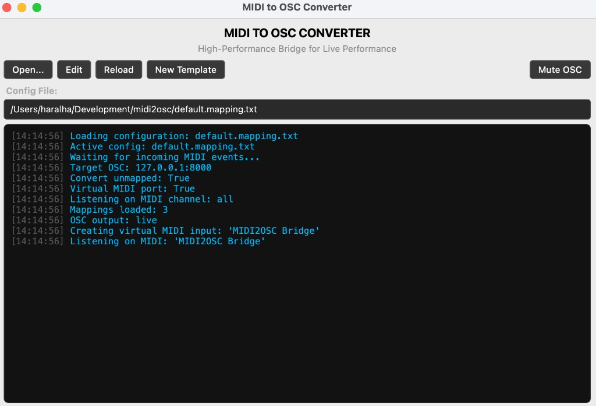

# MIDI to OSC Converter



A lightweight GUI and CLI application that converts incoming MIDI messages (`Note On/Off`, `Control Change`, `Program Change`, SysEx) into OSC packets over UDP.

Designed for live performances, stage automation, and media software such as Resolume, QLab, TouchDesigner, and Ableton Live.

## Features

- Human-readable `*.mapping.txt` configs for MIDI note, CC, and program routing
- Multi-profile support — pick a preset (e.g. `resolume.mapping.txt`, `qlab.mapping.txt`) at launch
- Optional value expressions (`v/127`, static ints, strings) for OSC payloads
- Native integer OSC arguments for velocity and CC values (`0–127`) when no expression is set
- Fallback routing for unmapped messages (e.g. `/midi/channel/1/note_on`)
- Channel filter (`channel = all`, `channel = 5`, `channel = 1-4,16`) to ignore everything on other MIDI channels
- Automatic reconnect when a MIDI device drops
- Mute OSC output at runtime (`--mute` in the CLI, toggle button in the GUI) for safe local testing
- Optional virtual MIDI input (`virtual = true`) on macOS/Linux; Windows users can use loopMIDI
- GUI built with PySide6 for easy control, alongside a headless CLI tool

## Prerequisites

- **For pre-built binaries:** None! Just download and run.
- **For CLI/pipx installation:** Python 3.11 (3.12+ is not supported; the GUI is pinned to PySide6 6.4 for older macOS) and `pipx`.
- **For local development:** Python 3.11 and Poetry.

---

## Installation

### Option 1: Download Pre-built Binaries (Recommended)

For most users (especially for live production), the easiest way to run the app is to download the standalone executable. You do not need to install Python.

1. Go to the [Releases](https://github.com/haralha/midi2osc/releases) page on GitHub.
2. Download the latest version for your operating system (macOS `.app` or Windows `.exe`).
3. Extract and run the application.

### Option 2: Install via `pipx` (For CLI users & Python developers)

If you prefer using the command line or want to install it as a global Python tool, `pipx` installs the application into an isolated environment and exposes the commands globally.

#### 1. Install `pipx`

**On macOS (via Homebrew):**
```bash
brew install pipx
pipx ensurepath
```

**On macOS / Linux / Windows (via Python):**
```bash
python3 -m pip install --user pipx
python3 -m pipx ensurepath
```
(Restart your terminal after running `ensurepath`.)

#### 2. Install midi2osc

From GitHub:
```bash
pipx install git+https://github.com/haralha/midi2osc.git
```

Or from a local clone:
```bash
git clone https://github.com/haralha/midi2osc.git
cd midi2osc
pipx install .
```

#### 3. Usage via pipx

```bash
midi2osc-gui                    # GUI
midi2osc run show.mapping.txt   # CLI
midi2osc list                   # list MIDI devices
midi2osc generate               # create a template config
pipx upgrade midi2osc           # update later
```

## Development & Local Execution

```bash
git clone https://github.com/haralha/midi2osc.git
cd midi2osc
poetry install
```

```bash
poetry run poe gui
poetry run poe cli
poetry run poe test
```

## Configuration (`*.mapping.txt`)

Use a `*.mapping.txt` file. Generate a starter template with:

```bash
midi2osc generate
# or: midi2osc generate -o show.mapping.txt
```

Print an example to stdout without writing a file:

```bash
midi2osc example
```

### Example

```
# Channels are 1-16 (same numbering as most DAWs / controllers).
# Notes/CC numbers are 0-127.

midi_port = "MIDI2OSC Bridge"
virtual = true
channel = all
ip = "127.0.0.1"
port = 8000
convert_unmapped = true

# note / note_on maps both note-on and note-off (incl. note_on velocity 0)
note 1 60 -> /resolume/layer1/clip1/connect 1
note 1 61 -> /qlab/cue/1/start
cc 1 7 -> /composition/master/volume v/127
pc 1 1 -> /qlab/cue/2/start
```

### Settings

| Key | Description |
|-----|-------------|
| `midi_port` | MIDI input device name (exact preferred; unique substring also works). With `virtual = true`, this is the name of the port to create. |
| `virtual` / `virtual_port` / `create_virtual` | If `true`, create a virtual MIDI input (macOS/Linux). On Windows use loopMIDI and keep this `false`. |
| `ip` / `host` | Target OSC IP (default `127.0.0.1`) |
| `port` / `osc_port` | Target OSC UDP port (default `7700`) |
| `convert_unmapped` | If `true`, unmapped messages are sent to `/midi/...` defaults; if `false`, they are only logged |
| `channel` / `channels` / `midi_channel` | MIDI channel(s) to listen on (default `all`) |

### Listening on specific channels

By default every channel `1–16` is processed. Set `channel` to listen to a subset — anything on the other channels is discarded before mapping, fallback routing, and logging.

```
channel = all        # every channel (default)
channel = 5          # only channel 5
channel = 1,3,9      # a few channels
channel = 1-4, 16    # ranges and single channels combined
```

SysEx has no channel, so it is always passed through. If a mapping targets a channel you are not listening on, a warning is logged when the config loads.

The CLI can override the file setting:

```bash
midi2osc run show.mapping.txt --channel 5
midi2osc run show.mapping.txt --channel 1-4,16
```

### Mapping syntax

```
<event> <channel 1-16> <number 0-127> -> /osc/address [expression]
sysex -> /midi/sysex
```

Event aliases: `note` / `note_on`, `cc` / `control`, `pc` / `program`.

**Note semantics:** `note_on` with velocity `0` is treated as note-off (MIDI convention). A single `note` mapping covers both on and off; the OSC value is the velocity (`0` for off), unless a value expression overrides it.

**Value expressions (optional):** After the OSC path you may add an expression. Use `v` for the incoming MIDI value (`0–127`). If omitted, the raw integer is sent.

| Expression | Result |
|------------|--------|
| *(omit)* | raw int `0–127` |
| `v/127` | float `0.0–1.0` |
| `1` | static int |
| `1 - (v/127)` | inverted float |
| `int(20 + v * 150)` | scaled int |
| `float(v)` / `int(v / 10)` | explicit cast |
| `"cue_{v}"` | string with `{v}` |
| `"At {v+50}"` | string with math inside `{…}` |

Only `+ - * / // % **`, parentheses, `v`, `int()`, and `float()` are allowed (no `eval`). The same rules apply inside string placeholders like `{v+50}`. Sysex mappings cannot use value expressions.

### CLI overrides

```bash
midi2osc run show.mapping.txt --midi-port "IAC Driver Bus 1" --ip 192.168.1.10 --port 7700
midi2osc run show.mapping.txt --channel 5
midi2osc run show.mapping.txt --quiet
midi2osc run show.mapping.txt --no-reconnect
midi2osc run show.mapping.txt --mute
```

### Muting OSC output

`--mute` keeps everything running but skips the actual UDP send, so incoming MIDI is still logged with the resolved OSC address and value (marked `(MUTED)`). Useful for verifying a new mapping file or checking which channel/CC a controller sends on without triggering anything in QLab, Resolume, or similar.

In the GUI, the **Mute OSC** button (or `Ctrl+M`) toggles the same behaviour while running. Mute survives a config reload but always starts off when the app launches.

Other commands:

```bash
midi2osc list
midi2osc generate
midi2osc example
```

## Building Executables

```bash
poetry run poe build        # Windows / Linux
poetry run poe build-mac    # macOS
```

Binaries are written to `bin/`.

### App icon

The icon lives in `midi2osc/assets/`: `icon.png` (1024x1024 master, also used for the Qt window/taskbar icon at runtime), `icon.icns` for the macOS `.app` bundle, and `icon.ico` for the Windows `.exe`. The build tasks pass the platform-specific file via `--icon` and bundle the PNG with `--add-data`. To change the icon, replace the PNG master and regenerate the `.icns` and `.ico` from it.

## Troubleshooting

- **"MIDI port unavailable / ambiguous"**: Ensure the `midi_port` in your config exactly matches (or is a unique substring of) the device name. Run `midi2osc list` in the CLI to see available names.
- **Windows Virtual Ports**: Windows does not natively support creating virtual MIDI ports. Set `virtual = false` in your config and use a third-party tool like [loopMIDI](https://www.tobias-erichsen.de/software/loopmidi.html) to route MIDI between applications.
- **No OSC received**: Check that your target software (Resolume, QLab) is listening on the same UDP port configured in your `*.mapping.txt` file (default `7700`).
